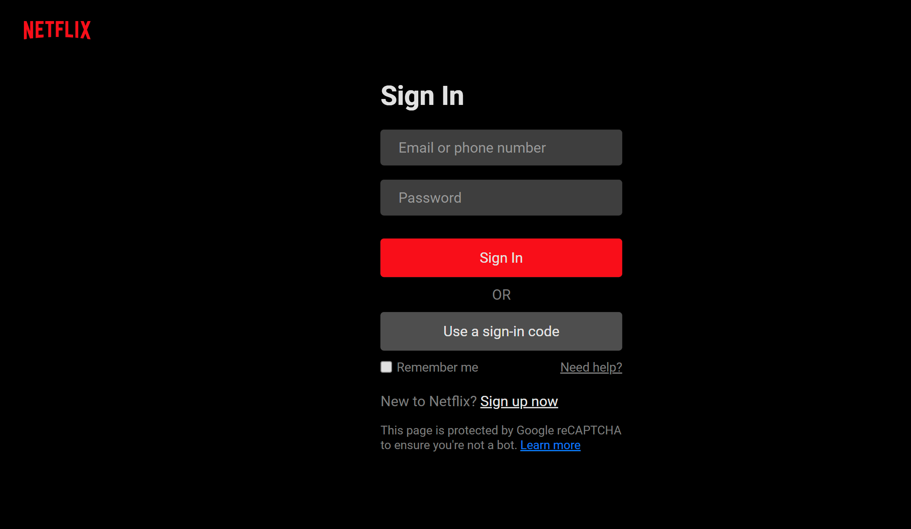

# 📺 Netflix Login Page Clone  

This project is a recreation of the Netflix login page as part of a frontend project to practise my skills in HTML, CSS, and JavaScript.

## 🚀 Features  

- **Responsive Design**: Ensures a seamless experience across various devices.  
- **Pixel-Perfect Recreation**: Mimics the original Netflix login page layout and styling.  
- **Interactive Form Elements**: Includes dynamic labels and hover effects for an intuitive user experience.  
- **Google Fonts Integration**: Uses the Roboto font for a modern, clean look.  

## 🛠️ Technologies Used  

- **HTML5**: For the structure of the page.  
- **CSS3**: For styling and layout, with transitions and hover effects.  
- **JavaScript**: Currently included for future interactivity (e.g., form validation).

## 📸 Screenshots  

